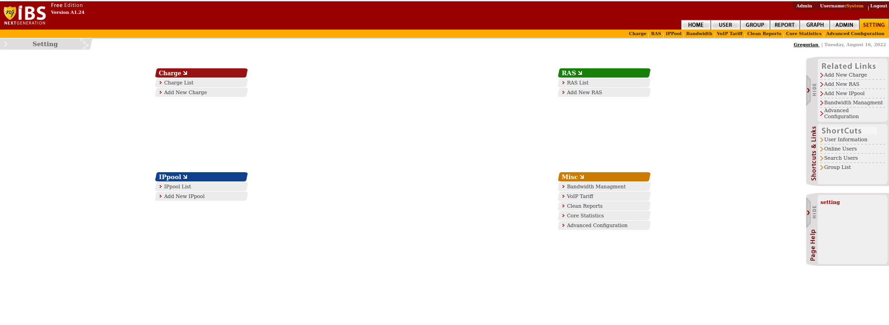

# VPN-Cisco-AnyConnect

This repository describe how to install cisco anyconnect on Centos 7
we will install tools and applications in this regard


##prerequisite
```sh
echo vpn.com > /etc/hostname

yum update
git clone git@github.com:heydarireza/VPN-Cisco-AnyConnect.git
cp -r files/*  /root/
```


##install necessary services and libraries
```sh
yum install autoconf automake gcc libtasn1-devel zlib zlib-devel trousers trousers-devel gmp-devel gmp xz texinfo libnl-devel libnl tcp_wrappers-libs tcp_wrappers-devel tcp_wrappers dbus dbus-devel ncurses-devel pam-devel readline-devel bison bison-devel flex gcc automake autoconf wget -y
```

then start the configuration:
```sh
cd
tar xvf nettle-2.7.tar.gz
cd nettle-2.7
./configure --prefix=/opt/
make
make install
```
```sh
cd
unxz gnutls-3.2.12.tar.xz
tar xvf gnutls-3.2.12.tar
cd gnutls-3.2.12
export LD_LIBRARY_PATH=/opt/lib/:/opt/lib64/
NETTLE_CFLAGS="-I/opt/include/" NETTLE_LIBS="-L/opt/lib64/ -lnettle" HOGWEED_CFLAGS="-I/opt/include" HOGWEED_LIBS="-L/opt/lib64/ -lhogweed" ./configure --prefix=/opt/
make
make install

```
```sh
cd
tar xvf libnl-3.2.24.tar.gz
cd libnl-3.2.24
./configure --prefix=/opt/
make
make install
```

Now install ocserv:

```sh
cd
unxz ocserv-0.8.9.tar.xz
tar xvf ocserv-0.8.9.tar
cd ocserv-0.8.9
export LD_LIBRARY_PATH=/opt/lib/:/opt/lib64/
LIBGNUTLS_CFLAGS="-I/opt/include/" LIBGNUTLS_LIBS="-L/opt/lib/ -lgnutls" LIBNL3_CFLAGS="-I/opt/include" LIBNL3_LIBS="-L/opt/lib/ -lnl-3 -lnl-route-3" ./configure --prefix=/opt/
make
make install
```

```sh
cd /etc
yum install unzip zip -y
cp /root/ocserv.zip /etc/
unzip ocserv.zip
vi /etc/ocserv/profile.xml
```


change these item based on your server :

```sh
<HostName>serverDNS</HostName>
<HostAddress>Server_IP</HostAddress>
```
Then enable port forwarding


```sh
vi  /etc/sysctl.conf

```
and add this line at the end of file 

```sh
net.ipv4.ip_forward = 1
```
then run this command :
```sh
sysctl -p
```

change Selinux paramenetr from enforcing to permissive

```sh
vi /etc/sysconfig/selinux

```
chaneg SELINUX=enforcing to SELINUX=permissive


Then add daemon

```sh
cd
tar zxf apps-sys-utils-start-stop-daemon-IR1_9_18-2.tar.gz
mv apps/sys-utils/start-stop-daemon-IR1_9_18-2/ ./
rm -rf apps
cd start-stop-daemon-IR1_9_18-2/
cc start-stop-daemon.c -o start-stop-daemon
cp start-stop-daemon /usr/local/bin/start-stop-daemon

```

than add these lines in to the /etc/init.d/ocserv

```sh

#!/bin/sh
### BEGIN INIT INFO
# Provides: ocserv
# Required-Start: $remote_fs $syslog
# Required-Stop: $remote_fs $syslog
# Default-Start: 2 3 4 5
# Default-Stop: 0 1 6
### END INIT INFO
# Copyright Rene Mayrhofer, Gibraltar, 1999
# This script is distibuted under the GPL

PATH=/bin:/opt/bin:/sbin:/opt/sbin
DAEMON=/opt/sbin/ocserv
PIDFILE=/var/run/ocserv.pid
DAEMON_ARGS="-c /etc/ocserv/ocserv.conf"

case "$1" in
start)
if [ ! -r $PIDFILE ]; then
echo -n "Starting OpenConnect VPN Server"
export LD_LIBRARY_PATH=/opt/lib/:/opt/lib64/
/usr/local/bin/start-stop-daemon --start --quiet --pidfile $PIDFILE --exec $DAEMON -- \
$DAEMON_ARGS > /dev/null
echo
else
echo -n "OpenConnect VPN Server is already running"
echo
exit 0
fi
;;
stop)
echo -n "Stopping OpenConnect VPN Server"
/usr/local/bin/start-stop-daemon --stop --quiet --pidfile $PIDFILE --exec $DAEMON
echo
rm -f $PIDFILE
;;
force-reload|restart)
echo "Restarting OpenConnect VPN Server"
$0 stop
sleep 1
$0 start
;;
status)
if [ ! -r $PIDFILE ]; then
echo -n "OpenConnect VPN Server Stoped"
echo
exit 3
fi
PID=`cat $PIDFILE | sed 's/ //g'`
EXE=/proc/$PID/exe
if [ -x "$EXE" ] &&
[ "`ls -l \"$EXE\" | cut -d'>' -f2,2 | cut -d' ' -f2,2`" = \
"$DAEMON" ]; then
echo -n "OpenConnect VPN Server run correctly"
echo
exit 0
elif [ -r $PIDFILE ]; then
echo -n "OpenConnect VPN Server stoped but pid file exist"
echo
exit 1
else
# no lock file to check for, so simply return the stopped status
exit 3
fi
;;
*)
echo "Usage: /etc/init.d/ocserv {start|stop|restart|force-reload|status}"
exit 1
;;
esac

exit 0


```

then enter these commands:

```sh

chmod 755 /etc/init.d/ocserv
chkconfig ocserv on

```
in this stage we need to install IBSng:

```sh
yum update –y

yum install httpd php postgresql postgresql-server postgresql-python perl unzip wget nano -y
yum install bzip2 -y
reboot
```
after that 

```sh
cd 
tar -xvjf IBSng-A1.24.tar.bz2 -C /usr/local
service postgresql initdb
service postgresql start


```

then edit /var/lib/pgsql/data/pg_hba.conf and this line

```sh
local  IBSng   ibs            trust


```


then create db :
```sh

su postgres
createdb IBSng
createuser ibs
createlang plpgsql IBSng
psql
\l
```
you can check whether the db is created  
then restart service:

```sh
\q
exit
systemctl restart postgresql
```

then install IBSng:
```sh
/usr/local/IBSng/scripts/setup.py
1:Install 
2  Test DB Connection and continue
2  Compile Configuration and continue       
1  Import Tables And Continue 
```
enter password and after that :

```sh
1  Copy ibs.conf to '/etc/httpd/conf.d'  
2  Chown apache directories to 'apache'  
5  Continue  
1  Copy Logrotate Conf to /etc/logrotate.d
3  Continue           
1  Copy Redhat init file to /etc/init.d  
2  Set IBSng to start on reboot          
3  Continue     
b  Back to main menu  
x  Exit      
```
then 
```sh
service iptables stop
service postgresql stop
service httpd stop
```
we need to edit /etc/httpd/conf/httpd.conf and add:
```sh
ServerName 127.0.0.1
<Directory "/usr/local/IBSng/interface/IBSng">
    AllowOverride None
    Options None
    Require all granted
</Directory>
```
and then add this line to /usr/local/IBSng/core/lib/IPy.py
```sh
#coding:utf-8
```

and add this line to the First line of /usr/local/IBSng/core/lib/mschap/des_c.py
```sh
#coding:utf-8
```


then edit  /usr/local/IBSng/interface/IBSng/inc/error.php and subsitute this line 


```sh

$timeArr="IRDT/4.0/DST";
#    $timeStr="{$timeArr["tm_year"]}/{$timeArr["tm_mon"]}/{$timeArr["tm_mday"]} {$timeArr["tm_hour"]}:{$timeArr["tm_min"]}";
    $phperr=isset($php_errormsg)?$php_errormsg:"";
#    fwrite($fh,"{$timeStr} {$msg} {$phperr}\n");
    return;

}

?>

```


then edit /usr/local/IBSng/core/server/xmlrpcserver.py  and add to the first line of it 

```sh

from xmlrpclib import Marshaller
from decimal import Decimal


def dump_decimal(self,value, write):
    write("<value><double>")
    write(str(value))
    write("</double></value>\n")


Marshaller.dispatch[Decimal] = dump_decimal


```
then edit /usr/local/IBSng/core/admin/admin.py

and find self.deposit+=deposit_change and change it to self.deposit+=float(deposit_change)

<br />
our config for ibsng is finished , at this point we need to add some rules in to the iptables or firewall
```sh

sudo iptables -A INPUT -p tcp --dport 80 -m conntrack --ctstate NEW,ESTABLISHED -j ACCEPT
sudo iptables -A OUTPUT -p tcp --sport 1812 -m conntrack --ctstate ESTABLISHED -j ACCEPT
sudo iptables -A INPUT -p tcp --dport 1813 -m conntrack --ctstate NEW,ESTABLISHED -j ACCEPT
firewall-cmd --add-port=80/tcp
firewall-cmd --add-port=1812/tcp
firewall-cmd --add-port=1813/tcp
firewall-cmd --runtime-to-permanent

```

and run IBSng
```sh

chkconfig httpd on
chkconfig postgresql on
chkconfig IBSng on
service httpd restart
service postgresql restart
setenforce 0
service IBSng start

```

check the web page :
http://<serverip>/IBSng/admin


after that we need to configure ibsng

```sh
cd
tar -xvf pam_radius-1.3.17.tar.gz
cd pam_radius-1.3.17
make
mkdir  /lib/security/
mkdir /etc/raddb/
cp pam_radius_auth.so /lib/security/

```

edit /etc/raddb/server and comment line with the code of other-server other-secret 3 and change filre with the begining of server 

```sh
<your server ip>   	<your secret>             30
127.0.0.1	<your secret> 	30


```
add these lines to  /etc/pam.d/ocserv
```sh
auth required /lib/security/pam_radius_auth.so
account required /lib/security/pam_radius_auth.so
session required /lib/security/pam_radius_auth.so
```


and finally enable nat 
```sh

iptables -t nat -A POSTROUTING -o eth0 -j MASQUERADE
sysctl -w net.ipv4.ip_forward=1

```

then go to the IBSng and login to the admin web page 




